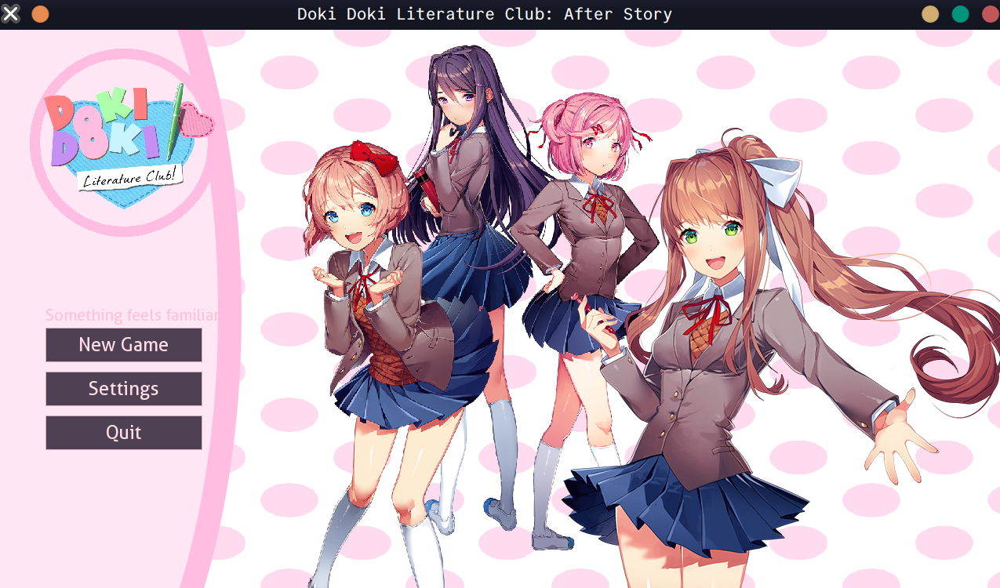
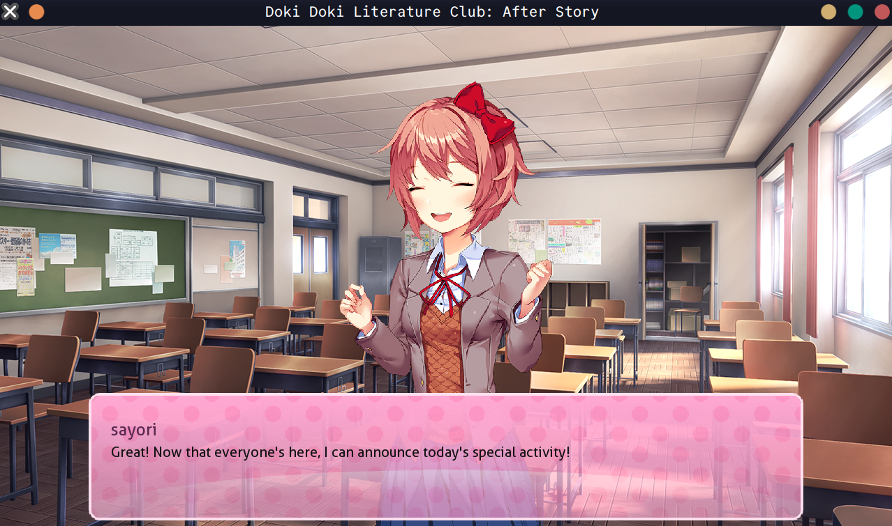
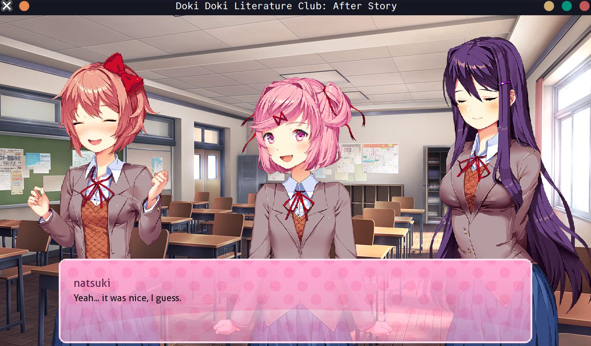
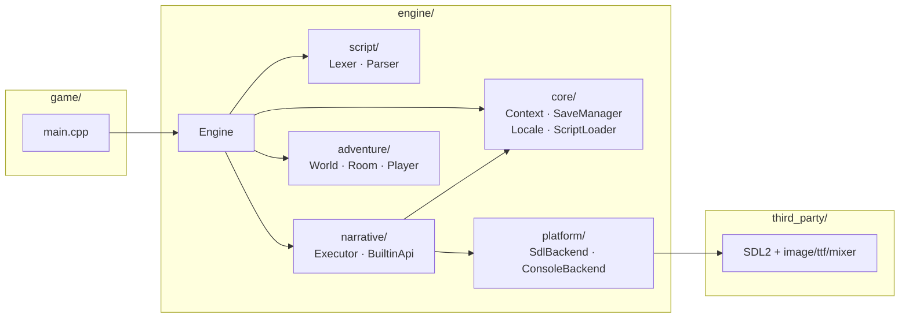

# Doki Doki Literature Club: After Story

基于自研 **novel** 视觉小说引擎的 DDLC 同人续作。C++17 实现，SDL2 渲染，跨 Linux / Windows 双平台。







## 快速开始

```bash
# 克隆（含 SDL2 子模块）
git clone --recursive <repo-url>
cd kai-fa-522_1

# 检测工具链
./ddlc.sh detect          # Linux
# .\ddlc.ps1 detect       # Windows

# 编译
./ddlc.sh build

# 运行
./ddlc.sh run
```

## 项目架构

```
kai-fa-522_1/
├── engine/                     # novel 视觉小说引擎
│   ├── script/                 #   词法分析 · 语法解析 → AST
│   ├── narrative/              #   脚本执行器 · 内建 API · 表达式求值
│   ├── adventure/              #   房间导航 · 玩家状态
│   ├── core/                   #   变量上下文 · 存档管理 · 国际化 · 脚本加载
│   └── platform/               #   渲染后端 (SDL / Console) · 路径工具
├── game/                       # 游戏入口 main.cpp
├── content/                    # 运行时资源
│   ├── scripts/{en,zh}/        #   .rpy 剧本 (中/英双语)
│   ├── images/                 #   背景 · 角色精灵
│   ├── audio/                  #   BGM · 音效
│   ├── gui/                    #   UI 素材 · 字体
│   └── locale/                 #   界面翻译 (en.json / zh.json)
├── third_party/                # Git 子模块: SDL2 / SDL_image / SDL_ttf / SDL_mixer
├── tools/                      # Python / Shell 工具链
│   ├── compile/detection.py    #   工具链完善度检测
│   ├── atlas_packer/           #   角色精灵合成 · 资源拷贝
│   ├── clean/                  #   工作区清理 (py / bash / ps1)
│   ├── bundle/package.py       #   一键打包流水线
│   └── build_content.py        #   内容构建入口
├── .github/workflows/          # CI/CD
│   ├── build.yml               #   推送 / PR → 双平台编译
│   └── release.yml             #   Tag → 自动发布
├── ddlc.sh                     # Linux 命令行入口
└── ddlc.ps1                    # Windows 命令行入口
```

### 引擎模块关系



## 构建要求

| 依赖 | 最低版本 | 说明 |
|------|---------|------|
| CMake | 3.14 | 构建系统 |
| C++ 编译器 | C++17 | GCC 8+ / Clang 7+ / MSVC 2019+ |
| Python | 3.8 | 内容管线 & 工具脚本 |
| Pillow | - | 精灵图合成（`pip install Pillow`） |
| Git | - | 子模块管理 |

SDL2 及其扩展库通过 Git 子模块以源码形式静态链接，无需系统安装。Linux 下需安装开发头文件：

```bash
# Ubuntu / Debian
sudo apt-get install -y \
    build-essential cmake ninja-build \
    libx11-dev libxext-dev libxrandr-dev libxcursor-dev libxi-dev \
    libasound2-dev libpulse-dev libfreetype-dev libharfbuzz-dev \
    libgl1-mesa-dev
```

Windows 下使用 Visual Studio 2019+ 即可，CMake 会自动配置 MSVC 编译选项。

## 工具链

通过根目录脚本统一调用（Linux `./ddlc.sh`，Windows `.\ddlc.ps1`）：

| 命令 | 功能 |
|------|------|
| `detect` | 检测 CMake、编译器、Python、子模块、分支状态 |
| `build-content` | 从原始素材合成精灵图、拷贝背景和音频 |
| `build` | CMake 配置 + 编译 |
| `run` | 编译并启动游戏 |
| `bundle` | 完整打包流水线 → `bundle/ddlc-<hash>/` |
| `clean` | 清理 build / bin / \_\_pycache\_\_ 等 |
| `clean-all` | 深度清理（含 content/） |

## CI/CD

| 工作流 | 触发条件 | 内容 |
|--------|---------|------|
| **Build** | push / PR → master | Linux + Windows 双平台 Release/Debug 编译，工具链检测 |
| **Release** | 推送 `v*` tag | 双平台构建 → 组装 bundle → 创建 GitHub Release |

## 脚本系统

游戏剧本使用参考 Ren'Py 的 `.rpy` 脚本语法，提供引擎内置JIT脚本解释器，支持：

- **对话** — `角色 "台词"` / 旁白
- **分支选择** — `menu:` + `"选项":` 块
- **精灵 / 背景 / 音频** — `show` / `scene` / `play music`
- **变量与条件** — `$ var = expr` / `if` / `elif` / `else`
- **房间导航** — `room` 定义 + `exit` 出口（文字冒险扩展）
- **存档 / 读档** — 内置存档槽位系统
- **故障艺术** — `glitch` 指令（撕裂、噪点、反色等特效）

完整语法参见 [SYNTAX.md](SYNTAX.md)。

## 许可

本项目为武汉理工大学软件工程实训课程作业。游戏内容基于 Team Salvato 的 *Doki Doki Literature Club!*，仅供学习用途。
