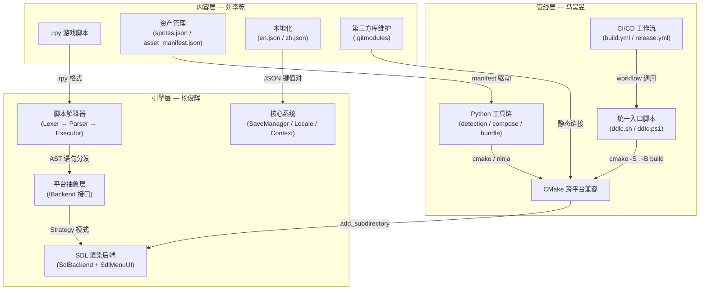
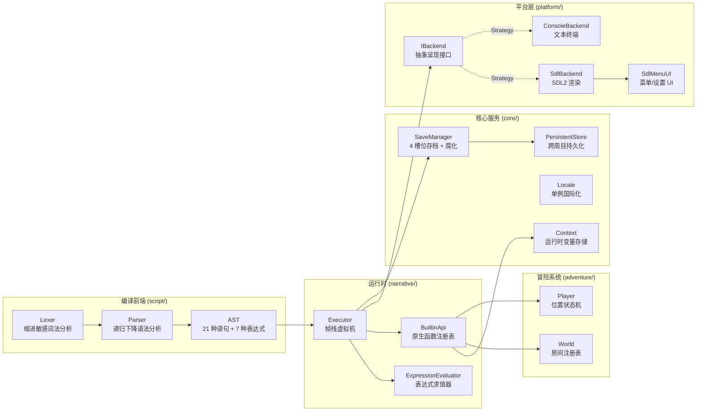
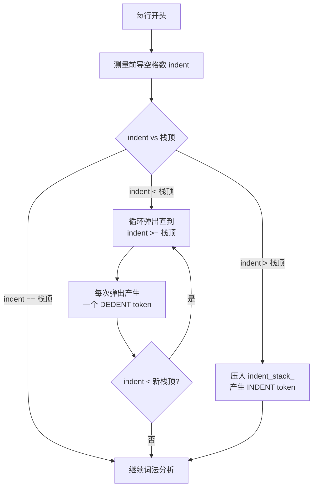
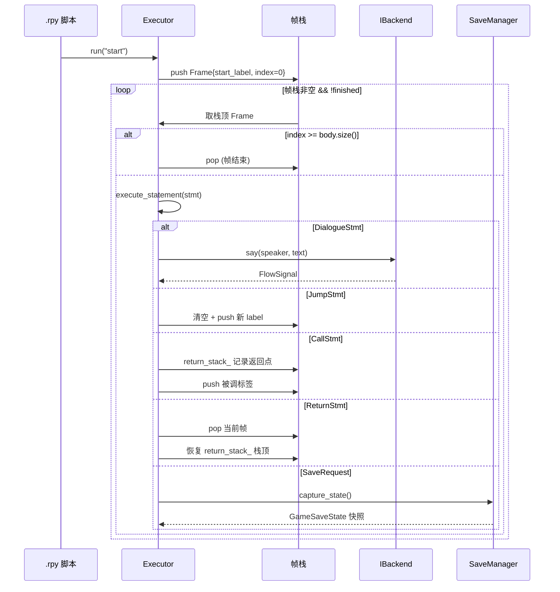
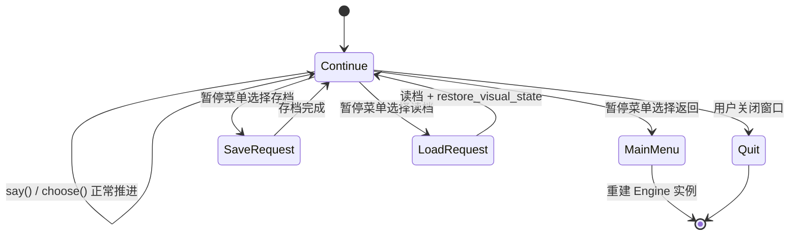
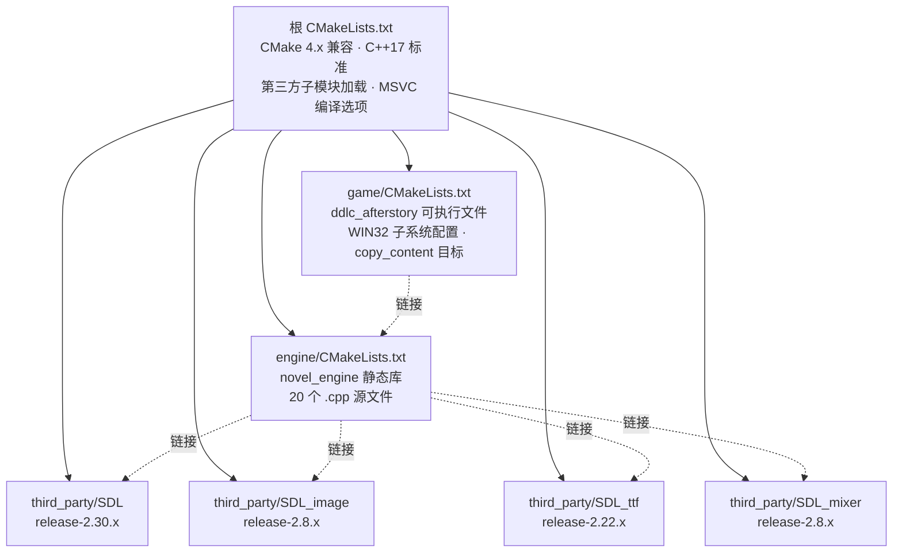
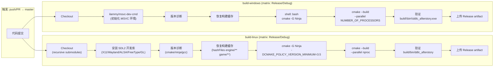
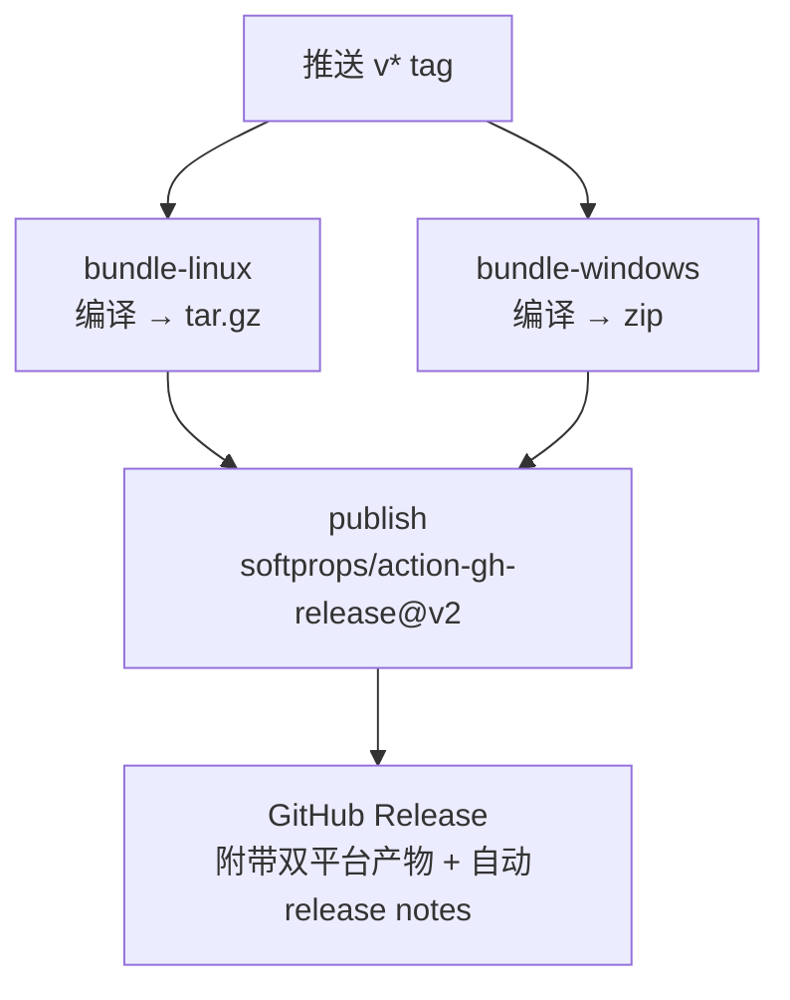
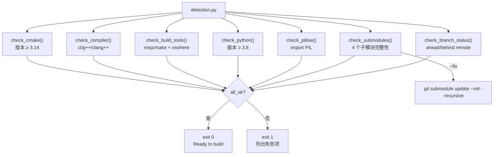

# 武汉理工大学软件工程实训报告

## 基于自研视觉小说游戏引擎的视觉小说游戏

---

**小组成员：** 马昊昱、刘李乾、杨俊辉

---

## 一、项目概述

### 1.1 项目背景与目标

本项目以经典独立游戏 *Doki Doki Literature Club!*（DDLC）为蓝本，以"自研引擎 + 原创续作"的形式，完成一个具备完整技术栈的视觉小说游戏。项目**不依赖任何现成的视觉小说框架**（如 Ren'Py），从底层的脚本解释器、SDL2 渲染后端、跨平台构建系统到上层的 Python 资源管线与 CI/CD 自动化发布，全部由小组自主设计与开发。

项目核心技术目标：

1. **自研领域特定语言（DSL）**：设计并实现一套参考 Ren'Py 的 `.rpy` 脚本语言，包含完整的 Lexer → Parser → AST → Executor 编译/执行管线
2. **跨平台引擎架构**：基于 Strategy 模式的可替换后端，支持 SDL2 图形模式与 Console 调试模式
3. **工业级 CI/CD 管线**：双平台（Linux/Windows）自动编译 + Tag 触发自动发布，解决 CMake 4.x / MSVC / NASM 等跨平台兼容性问题
4. **内容管线自动化**：Manifest 驱动的资产拷贝 + Pillow 三层 Alpha 合成的精灵生成

### 1.2 技术选型

| 层次 | 技术 | 选型理由 |
|------|------|----------|
| 引擎语言 | C++17 | `std::filesystem` 跨平台路径、`std::optional` 安全值语义、`std::variant` 动态类型 |
| 图形/音频 | SDL2 全家桶 | 轻量级跨平台抽象，Git 子模块静态链接消除运行时依赖 |
| 构建系统 | CMake 3.14+ | 唯一成熟支持 MSVC + GCC + Clang 的跨平台元构建系统 |
| 脚本语言 | 自定义 .rpy 方言 | Ren'Py 社区生态成熟但运行时笨重，自研可深度定制元游戏能力 |
| 工具链 | Python 3.8+ | Pillow 图像处理生态、跨平台脚本能力 |
| CI/CD | GitHub Actions | 原生支持 matrix 构建、缓存、artifact 上传 |

### 1.3 项目规模

| 类别 | 文件数 | 代码行数 |
|------|--------|----------|
| C++ 引擎 + 游戏入口 | ~25 | ~5,751 |
| Python 工具链 | ~8 | ~1,219 |
| .rpy 游戏脚本（双语） | 20 | ~5,783 |
| CI/CD + 构建脚本 | ~6 | ~630 |
| **合计** | **~59** | **~13,383** |

---

## 二、小组分工与协作架构

### 2.1 成员职责

| 成员 | 主要职责 | 核心产出 |
|------|----------|----------|
| **杨俊辉** | 视觉小说引擎开发 | novel 引擎全栈：SDL 渲染后端、UI 特效系统、跨平台适配、脚本解释器（Lexer/Parser/Executor）、编译工具链适配 |
| **马昊昱** | 游戏开发管线维护 | Python 工具链全套、CI/CD 工作流、构建/打包/发布自动化、CMake 跨平台兼容 |
| **刘李乾** | 游戏 Gameplay 迭代 | .rpy 剧本编写（中英双语）、脚本语言简化设计、资产/图集/音频管理、本地化系统、第三方库维护、引擎玩法逻辑适配 |

### 2.2 三层解耦协作模型

小组采用"引擎—管线—内容"三层分离的协作架构，各层通过明确定义的接口解耦：



**接口契约**：
- **引擎 ↔ 内容**：通过 `.rpy` 脚本格式定义，Lexer 支持的 Token 集合即为内容层可用的语法能力边界
- **引擎 ↔ 管线**：通过 `CMakeLists.txt` 的 target 名称（`novel_engine`、`ddlc_afterstory`）和目录约定（`build/bin/`）对接
- **管线 ↔ 内容**：通过 `asset_manifest.json` 和 `sprites.json` 声明式定义资产映射关系

---

## 三、引擎核心架构设计（杨俊辉）

### 3.1 总体架构与设计模式

novel 引擎采用分层架构，每层职责单一，通过接口或数据结构解耦：



核心设计模式应用：

| 设计模式 | 应用位置 | 技术细节 |
|----------|----------|----------|
| **Facade** | `Engine` 类 | 封装 script/narrative/adventure/core/platform 五个子系统，对外暴露 `load_script_file`、`run`、`run_from_slot` 等高层 API |
| **Strategy** | `IBackend` 接口 | 定义 30+ 个纯虚方法（`say`、`show_background`、`glitch` 等），`SdlBackend` 和 `ConsoleBackend` 为两个具体策略 |
| **Interpreter** | Lexer → Parser → AST → Executor | 经典编译器前端 + 树遍历解释器，支持 21 种语句和 7 种表达式 |
| **Frame Stack** | `Executor::run_frames` | 显式帧栈替代递归调用，支持 `call`/`return` 跨标签跳转及存档状态快照 |
| **Singleton** | `Locale::instance()` | 全局唯一国际化服务，运行时热切换语言 |
| **Registry** | `BuiltinApi` | 原生函数注册表，支持 `register_native(name, fn)` 动态扩展脚本可调用的 C++ 函数 |
| **RAII** | SDL 资源管理 | `unique_ptr<SDL_Texture, decltype(&SDL_DestroyTexture)>` 自定义 deleter，防止纹理/音频泄漏 |

### 3.2 脚本解释器——自研 DSL 全栈

脚本解释器是本项目最核心的技术模块，实现了从源码文本到运行时执行的完整管线。

#### 3.2.1 词法分析器（Lexer）

Lexer 的核心挑战在于 **Python 风格的缩进敏感语法**。与大多数语言使用 `{}` 或 `begin/end` 界定代码块不同，`.rpy` 脚本通过缩进层级表达嵌套关系，这要求 Lexer 维护一个显式的缩进栈。

**缩进处理算法**：



**Token 类型设计**（约 40 种）：
- **结构 Token**：`Indent`、`Dedent`、`Newline`、`Eof`
- **关键字 Token**：`Label`、`Menu`、`If`、`Elif`、`Else`、`Jump`、`Call`、`Return`、`Room`、`Exit`、`Show`、`Hide`、`Bg`、`Scene`、`Go`、`PlayMusic`、`StopMusic`、`PlaySound`、`StopSound`、`PlayAmbient`、`StopAmbient`、`Glitch`、`WindowTitle`、`FakeCrash`、`Default`、`At`、`True`、`False`
- **运算符 Token**：`Plus`、`Minus`、`Star`、`Slash`、`Eq`、`Ne`、`Lt`、`Le`、`Gt`、`Ge`、`And`、`Or`、`Not`、`Assign`
- **特殊 Token**：`Dollar`（`$ expr` 表达式语句标志）、`Colon`、`LeftParen`、`RightParen`

**字符串插值的递归 Lexer**：当 Lexer 遇到字符串字面量中的 `[expr]` 时，会创建一个子 Lexer 实例递归解析 `expr` 部分，将结果拼接回字符串 Token 序列。这使得对话文本中可以嵌入任意表达式：

```renpy
sayori "我和 [player_name] 一起走了 [steps + 1] 步！"
```

#### 3.2.2 语法分析器（Parser）

Parser 采用经典的**递归下降**（Recursive Descent）算法，为每种语法结构定义一个解析函数。

**AST 节点体系**：

AST 采用继承多态设计，以 `unique_ptr` 管理内存生命周期：

```mermaid
classDiagram
    class Expr {
        <<abstract>>
        +Kind kind()
    }
    class StringExpr { +string value }
    class NumberExpr { +double value }
    class BoolExpr { +bool value }
    class VariableExpr { +string name }
    class UnaryExpr { +UnaryOp op; +ExprPtr operand }
    class BinaryExpr { +BinaryOp op; +ExprPtr left; +ExprPtr right }
    class CallExpr { +string name; +vector~ExprPtr~ args }

    Expr <|-- StringExpr
    Expr <|-- NumberExpr
    Expr <|-- BoolExpr
    Expr <|-- VariableExpr
    Expr <|-- UnaryExpr
    Expr <|-- BinaryExpr
    Expr <|-- CallExpr

    class Stmt {
        <<abstract>>
        +Kind kind()
    }
    class DialogueStmt { +string speaker; +ExprPtr text }
    class SayStmt { +ExprPtr text }
    class IfStmt { +vector~IfBranch~ branches; +StmtList else_body }
    class MenuStmt { +vector~MenuChoice~ choices }
    class AssignStmt { +string name; +ExprPtr value }
    class JumpStmt { +string label }
    class CallStmt { +string label }
    class ShowStmt { +string tag; +string image_path; +string position }
    class GlitchStmt { +string type; +int duration_ms }
    class FakeCrashStmt { +string message }

    Stmt <|-- DialogueStmt
    Stmt <|-- SayStmt
    Stmt <|-- IfStmt
    Stmt <|-- MenuStmt
    Stmt <|-- AssignStmt
    Stmt <|-- JumpStmt
    Stmt <|-- CallStmt
    Stmt <|-- ShowStmt
    Stmt <|-- GlitchStmt
    Stmt <|-- FakeCrashStmt

    class ScriptModule {
        +vector~RoomDef~ rooms
        +vector~DefaultDef~ defaults
        +vector~Label~ labels
    }
```



共 **7 种表达式**（`String`/`Number`/`Bool`/`Variable`/`Unary`/`Binary`/`Call`）和 **21 种语句**（涵盖叙事、控制流、视觉、音频、元游戏五个维度）。

**表达式优先级**（从低到高）：

| 优先级 | 运算符 | 解析函数 |
|--------|--------|----------|
| 1（最低） | `or` | `parse_or_expr()` |
| 2 | `and` | `parse_and_expr()` |
| 3 | `==` `!=` `<` `<=` `>` `>=` | `parse_comparison()` |
| 4 | `+` `-` | `parse_additive()` |
| 5 | `*` `/` | `parse_multiplicative()` |
| 6 | `not` `-`（一元） | `parse_unary()` |
| 7（最高） | 字面量、变量、函数调用、`(expr)` | `parse_primary()` |

#### 3.2.3 执行器（Executor）——帧栈虚拟机

Executor 是解释器的运行时核心。与简单的 AST 树遍历不同，Executor 使用**显式帧栈**（Frame Stack）模型，这一设计决策带来两个关键能力：

1. **存档快照**：任意时刻可通过 `capture_state()` 序列化当前执行位置（label + statement_index + return_stack），实现精确到语句级别的存档/读档
2. **无递归执行**：避免 C++ 调用栈深度限制，支持任意深度的 `call`/`return` 嵌套

**帧栈执行模型**：



**状态快照结构**（`GameSaveState`）——存档的本质是 Executor 状态的完整序列化：

```cpp
struct GameSaveState {
    std::string label;                              // 当前标签
    std::size_t statement_index;                    // 语句偏移
    std::vector<ReturnFrame> return_stack;          // 调用栈
    std::unordered_map<std::string, Value> variables; // 全部运行时变量
    std::string background;                         // 当前背景
    std::vector<SpriteState> sprites;               // 精灵列表
    int save_generation, day, glitch_count;         // 元数据
    bool corrupted;                                 // 腐化标记
};
```

### 3.3 渲染后端与平台抽象

#### 3.3.1 IBackend 抽象接口

`IBackend` 定义了引擎与呈现层之间的完整契约（30+ 个纯虚方法），覆盖五个维度：

| 维度 | 方法 | 语义 |
|------|------|------|
| **UI** | `show_main_menu`、`show_settings`、`show_pause_menu`、`show_slot_menu` | 阻塞式菜单交互，返回枚举动作 |
| **叙事** | `say(speaker, text)` → `FlowSignal`、`choose(options)` → `ChoiceResult` | 文字推进，返回控制流信号 |
| **场景** | `show_background`、`show_sprite`、`hide_sprite`、`on_scene_changed`、`clear_sprites` | 背景/精灵管理 |
| **音频** | `play_music`（fadein/volume/loop）、`play_sound`、`play_ambient` 及对应 stop | 多通道音频控制 |
| **元游戏** | `glitch(type, duration)`、`fake_crash(msg)`、`set_window_title` | 第四面墙特效 |

**FlowSignal 枚举**控制引擎主循环的状态转移：



#### 3.3.2 SDL 渲染后端技术细节

`SdlBackend`（约 1,057 行）+ `SdlMenuUI`（约 598 行）构成完整的图形呈现实现。

**分辨率无关渲染**：

引擎以 1280×720 作为参考坐标系。所有 UI 元素的坐标和尺寸均在参考空间中定义，运行时通过缩放因子映射到实际窗口尺寸：

```
sx(x) = x * (actual_width / 1280.0)
sy(y) = y * (actual_height / 720.0)
```

支持的分辨率档位：960×540、1280×720、1600×900、1920×1080，以及全屏模式（`SDL_WINDOW_FULLSCREEN_DESKTOP`）。

**纹理缓存机制**：

`texture_cache_`（`unordered_map<string, SDL_Texture*>`）维护已加载纹理的缓存。所有 `show_background` 和 `show_sprite` 调用优先查缓存，未命中时通过 `IMG_LoadTexture` 加载并缓存。`on_scene_changed` 时清空缓存防止内存膨胀。

**Glitch 特效实现**：

Glitch 系统基于离屏渲染（off-screen rendering）实现。关键步骤：

1. 将当前场景渲染到 `scene_target`（`SDL_TEXTURE_TARGET` 纹理）
2. 根据 `type` 参数选择效果组合（`tear` / `invert` / `noise` / `vignette` / `combined`）
3. **Tear（撕裂）**：将 `scene_target` 按随机偏移分条带（strip）渲染，模拟信号撕裂
4. **Invert（反色）**：`SDL_SetTextureColorMod` 反转 RGB 通道
5. **Noise（噪点）**：逐像素随机填充 `noise_texture`，混合叠加
6. **Vignette（暗角）**：径向衰减 Alpha 遮罩

**Fake Crash 实现**：全屏噪点纹理 + 仿 BSOD 文案渲染 + 定时器控制的 tear 恢复动画序列。

#### 3.3.3 Console 后端

`ConsoleBackend`（134 行）提供纯文本后备实现：`say()` 打印到 stdout，`choose()` 通过数字输入选择。Windows 下通过 `SetConsoleOutputCP(CP_UTF8)` 设置 UTF-8 代码页。此后端的存在使引擎具备 CI 环境下的无头测试能力。

### 3.4 存档系统与元游戏机制

#### 3.4.1 存档序列化格式

`SaveManager` 采用自定义文本格式 `.sav`，避免引入 JSON/XML 等第三方序列化库：

```
version=1
label=act1_day1
statement_index=42
day=1
glitch_count=0
save_generation=1
corrupted=false
background=images/bg/classroom.png
sprite=sayori|images/characters/sayori/1ahappy.png|center
var.player_name=MC
var.affection_sayori=3
var.poem_shared=true
return=club_activities|15
```

每行一个键值对，`var.` 前缀的行为运行时变量，`sprite=` 和 `return=` 可出现多次。

#### 3.4.2 存档腐化机制

当 `day >= 3` 或 `glitch_count >= 2` 时，`SaveManager` 自动标记存档为 `corrupted=true` 并在存档目录生成 `slot_N_monika.txt` 元数据文件（包含 Monika 风格的旁白文字）。腐化存档在 UI 中以特殊样式展示，读档后可触发 `save_loaded_hook` 标签中的元叙事。

#### 3.4.3 跨周目持久化

`PersistentStore` 独立于普通存档系统，记录跨游戏生命周期的元数据：

| 字段 | 说明 |
|------|------|
| `playthrough_count` | 通关次数（触发多周目 UI 演化） |
| `launch_count` | 启动次数（脚本中可通过 `get_launch_count()` 查询） |
| `total_play_seconds` | 累计游戏时间 |

`Engine::register_meta_functions()` 将这些数据通过 `BuiltinApi` 注册为脚本可调用的原生函数（`get_playthrough()`、`get_launch_count()`、`get_hour()`、`character_exists(name)`、`delete_character(name)` 等），使脚本层能基于元数据驱动叙事分支。

---

## 四、CI/CD 与跨平台构建系统（马昊昱）

### 4.1 构建系统架构

#### 4.1.1 CMake 模块化设计

项目采用三级 CMakeLists.txt 结构：



#### 4.1.2 CMake 目录属性继承与编译选项隔离

项目面临的核心构建难题是：MSVC 编译选项（`/utf-8`、`/EHsc`）通过 `add_compile_options()` 声明后，会沿 CMake 目录树向下继承到所有子目录。这导致两个严重问题：

1. **NASM 污染**：SDL_image 依赖的 dav1d 使用 NASM 汇编器编译，NASM 将 `/utf-8` 和 `/EHsc` 解释为输入文件路径，导致 `fatal: more than one input file specified`
2. **字符集冲突**：libavif 自带 `/source-charset:utf-8`，与全局 `/utf-8`（等价于 `/source-charset:utf-8 /execution-charset:utf-8`）冲突，MSVC 报 `D8016: incompatible`

**解决方案**——利用 CMake 目录属性继承的**时序特性**：

`add_compile_options()` 修改当前目录的 `COMPILE_OPTIONS` 属性。`add_subdirectory()` 在调用时刻将父目录的属性快照复制给子目录。因此，**声明顺序决定了继承范围**。

将 `add_compile_options(/utf-8 /EHsc)` 移至所有第三方 `add_subdirectory()` **之后**、项目 `add_subdirectory(engine)` / `add_subdirectory(game)` **之前**：

```cmake
# 第三方库先加载（继承空的 COMPILE_OPTIONS）
add_subdirectory(third_party/SDL EXCLUDE_FROM_ALL)
add_subdirectory(third_party/SDL_image EXCLUDE_FROM_ALL)
add_subdirectory(third_party/SDL_ttf EXCLUDE_FROM_ALL)
add_subdirectory(third_party/SDL_mixer EXCLUDE_FROM_ALL)

# 项目编译选项在此声明（仅 engine/game 继承）
if(MSVC)
    add_compile_options(/utf-8 /EHsc)
    add_compile_definitions(NOMINMAX _CRT_SECURE_NO_WARNINGS)
endif()

add_subdirectory(engine)  # 继承 /utf-8 /EHsc
add_subdirectory(game)    # 继承 /utf-8 /EHsc
```

#### 4.1.3 CMake 4.x 兼容性

`windows-latest` GitHub Actions runner 搭载 CMake 4.x，而 SDL2 子模块使用 `cmake_minimum_required(VERSION 3.0.0...3.10)` 这样的旧版声明，被 CMake 4.0 拒绝（策略版本下限必须 ≥ 3.5）。

**解决方案**——`CMAKE_POLICY_VERSION_MINIMUM` cache 变量：

```cmake
if(CMAKE_VERSION VERSION_GREATER_EQUAL "4.0")
    set(CMAKE_POLICY_VERSION_MINIMUM 3.5 CACHE STRING
        "Minimum policy version for cmake_minimum_required (CMake 4.x compat)")
endif()
```

使用 `CACHE STRING`（而非普通变量）确保该值全局可见——包括所有 `add_subdirectory()` 递归引入的深层子模块。不加 `FORCE` 标志则保证命令行 `-D` 传入的值优先。

此外，在 CI 中还需处理 **PowerShell 参数解析问题**：PowerShell 将 `-DCMAKE_POLICY_VERSION_MINIMUM=3.5` 中的 `.5` 视为独立 token，导致 CMake 收到的值为 `"3"` 而非 `"3.5"`。解决方案是将 Windows Configure 步骤的 shell 切换为 `bash`（Git Bash）。

### 4.2 CI/CD 工作流设计

#### 4.2.1 持续集成流水线



**缓存策略**：cache key 为 `{platform}-{build_type}-{hashFiles('CMakeLists.txt', 'engine/**', 'game/**', '.gitmodules')}`，覆盖 CMakeLists 和全部引擎/游戏源码，确保源码变更时自动失效。

#### 4.2.2 持续部署流水线

推送 `v*` tag 时触发，双平台并行打包后由 `publish` job 汇聚发布：



### 4.3 Python 工具链

#### 4.3.1 工具链检测系统

`detection.py`（393 行）实现了一套跨平台的开发环境自动诊断：



支持 `--json` 机器可读输出，CI 中的 `toolchain-check` job 直接调用并基于退出码判定。

#### 4.3.2 精灵合成管线

`compose_sprites.py`（235 行）基于 Pillow 实现 DDLC 角色精灵的三层 Alpha 合成：

```
assets/images/{char}/     输入层
├── 1l.png                左臂 pose（layer 1）
├── 1r.png                右臂 pose（layer 2）
├── happy.png             表情 face （layer 3）
└── ...

compose(base=1l, overlay=1r, face=happy)
    → content/images/characters/{char}/1happy.png
```

合成规则声明于 `sprites.json`（约 105 条规则），覆盖 4 角色 × 4 pose × 多表情的全部组合。

#### 4.3.3 打包流水线

`package.py`（245 行）编排 5 步自动化：

1. **检测**：调用 `detection.py`（可 `--skip-check` 跳过）
2. **内容构建**：调用 `build_content.py`（可 `--skip-content` 跳过）
3. **CMake Configure**：自动检测 Ninja 可用性，传递 `-DCMAKE_POLICY_VERSION_MINIMUM=3.5`
4. **CMake Build**：`--parallel` 自动匹配 CPU 核心数
5. **组装 Bundle**：可执行文件 + `content/` 目录，输出到 `bundle/ddlc-{hash}/`

支持 `--dry-run` 预览模式和 `--output-dir` 自定义输出路径。

---

## 五、Gameplay 技术适配（刘李乾）

### 5.1 脚本语言能力设计

刘李乾在杨俊辉提供的解释器基础上，参与了脚本语言的语法能力设计。最终确定的 DSL 能力矩阵：

| 能力维度 | 语法关键字 | 底层实现 |
|----------|-----------|----------|
| 叙事 | `narrator`、`{speaker} "text" {emotion}` | `SayStmt` / `DialogueStmt` → `IBackend::say()` |
| 分支 | `menu:` + 缩进选项体 | `MenuStmt` → `IBackend::choose()` |
| 条件 | `if`/`elif`/`else` + 缩进体 | `IfStmt` + `ExpressionEvaluator` |
| 变量 | `$ var = expr`、`default var = value` | `AssignStmt` / `DefaultDef` → `Context` |
| 控制流 | `jump`、`call`、`return` | `JumpStmt` / `CallStmt` / `ReturnStmt` → 帧栈操作 |
| 场景 | `bg`、`show`/`hide` + `at left/center/right` | `BgStmt` / `ShowStmt` / `HideStmt` → `IBackend` |
| 音频 | `play music/sound/ambient`、`stop music/sound/ambient` | 六种 Stmt → `IBackend` 音频方法 |
| 房间 | `room id "desc":` + `exit dir target` | `RoomDef` → `World::define_room()` |
| 导航 | `scene room_id`、`go direction` | `SceneStmt` / `GoStmt` → `BuiltinApi` |
| 元游戏 | `glitch type`、`fake crash`、`window title` | 三种 Stmt → `IBackend` 元游戏方法 |

### 5.2 本地化架构

双层本地化设计：

- **UI 层**：`Locale` 单例加载 `content/locale/{lang}.json`（65 键），引擎内部通过 `tr("key")` 查询，支持运行时热切换
- **剧本层**：`content/scripts/en/` 和 `content/scripts/zh/` 独立目录，切换语言时 `Engine` 重新加载对应目录的 `.rpy` 文件

此设计避免了在脚本中嵌入翻译标记，使翻译工作完全独立于引擎代码。

### 5.3 第三方库集成

4 个 SDL 子模块全部以静态库方式编译链接（`SDL_SHARED OFF` + `SDL_STATIC ON`），通过 `.gitmodules` 固定 release 分支。引擎通过 CMake target 别名（`SDL2::SDL2-static`、`SDL2_image::SDL2_image-static` 等）链接，使 `engine/CMakeLists.txt` 无需关心子模块内部细节。

---

## 六、AI 辅助开发说明

### 6.1 AI 工具总览

| AI 模型 | 运行平台 | 主要使用者 | 辅助领域 |
|---------|----------|-----------|----------|
| **GPT-5.5** | OpenAI Codex | 马昊昱 | 工具管线维护、CI/CD 工作流 |
| **Claude Opus 4.6** | Claude Code | 杨俊辉 | 引擎开发、跨平台适配 |
| **Deepseek V4 Pro** | Deepseek | 全组 | 文档编写 |
| **微调 AI 模型** | 各平台 | 刘李乾 | 图集/音频资产生成与处理 |

### 6.2 GPT-5.5（Codex）— 工具管线维护

**使用者**：马昊昱

**运行环境**：OpenAI Codex 平台，结合 **Git MCP**（Model Context Protocol）与 **GitHub Skill**。

**辅助完成的具体工作**：

1. **CI/CD 工作流迭代**：
   - GitHub Actions 双平台构建矩阵的编写与调试
   - CMake 4.x 兼容性问题的排查（`CMAKE_POLICY_VERSION_MINIMUM` cache 变量方案）
   - PowerShell 参数解析问题的诊断与 `shell: bash` 绕过方案
   - 构建缓存策略优化（`hashFiles` 覆盖 `engine/**` 和 `game/**`）

2. **Python 工具链开发**：
   - `detection.py` 工具链检测脚本的跨平台分支逻辑
   - `package.py` 打包流水线的多步骤编排与错误处理
   - `compose_sprites.py` 三层 Alpha 精灵合成逻辑

3. **Git MCP + GitHub Skill 协作模式**：
   - 通过 Git MCP 实现对仓库状态的实时感知（分支、提交历史、子模块 commit SHA）
   - 利用 GitHub Skill 自动化 PR 创建、Issue 管理、CI 状态追踪
   - 形成"CI 失败 → AI 分析日志 → 生成修复 → 推送验证"的闭环迭代

### 6.3 Claude Opus 4.6（Claude Code）— 引擎开发

**使用者**：杨俊辉

**运行环境**：Claude Code（命令行模式），配合 Zed 编辑器的 API 调用及 **SuperPower** 等 Skill。

**辅助完成的具体工作**：

1. **引擎核心架构**：
   - `Engine` Facade 类的 API 设计（`load_script_file` / `run` / `run_from_slot` 等）
   - `IBackend` Strategy 接口的 30+ 方法抽象
   - Executor 帧栈虚拟机的执行模型与状态快照机制

2. **跨平台引擎适配**：
   - SDL2 四子模块在 Linux/Windows 上的静态编译适配
   - MSVC 编译选项与 NASM/libavif 的兼容性隔离方案
   - Console UTF-8 代码页设置（Windows 特有）

3. **SuperPower Skill 的"自迭代"模式**：

   核心理念：确保渲染效果的开发（Glitch / Fake Crash 等特效）**永远不会影响 OS 层面的适配逻辑**。

   具体实践：AI 在修改 `SdlBackend` 渲染代码后，自动检查以下维度：
   - 编译路径：新增的头文件引用是否在 Linux/Windows 上均可达
   - 链接依赖：新增的 SDL API 调用是否在目标 SDL 版本中存在
   - 运行时行为：纹理格式、音频通道数等是否跨平台一致

   形成"渲染开发 → 平台验证 → 自动回归"的安全迭代流程。

4. **脚本解释器开发**：
   - Lexer 缩进感知算法（indent_stack + Indent/Dedent token 生成）
   - Parser 递归下降逻辑与 21 种 AST 节点的类型设计
   - ExpressionEvaluator 的优先级系统与字符串插值递归解析

### 6.4 Deepseek V4 Pro — 文档编写

**使用者**：全组共用

**辅助工作**：
- `README.md` 项目文档的结构设计与撰写
- 脚本语法说明等技术文档的初稿生成
- 代码注释的规范化建议

### 6.5 微调 AI 模型 — 资产生成

**使用者**：刘李乾

**辅助工作**：
- 部分角色精灵素材的 AI 生成与后期处理
- 背景场景图的 AI 辅助绘制
- 音频素材的 AI 辅助处理（降噪、格式转换等）
- 使用各平台提供的微调模型，针对 DDLC 美术风格进行适配

### 6.6 AI 辅助开发的反思

**效率提升**：
- AI 在跨平台兼容性调试中表现突出，CMake 4.x / MSVC / NASM / PowerShell 等组合问题的排查从"数小时人工试错"缩短为"一轮 AI 分析 + 验证"
- 引擎开发中 AI 的"自迭代"能力帮助维护了渲染层与平台层的解耦，减少了跨模块回归风险
- CI/CD 工作流的搭建得益于 AI 对 GitHub Actions YAML 语法和跨平台环境差异的深入理解

**局限性**：
- AI 生成的代码仍需人工 review，PowerShell 参数解析问题即为 AI 初次生成时未能预见的案例
- 编译原理相关的核心设计决策（缩进感知算法、帧栈执行模型、表达式优先级等）需要开发者具备扎实的理论基础，AI 在此更多是加速实现而非替代设计
- 素材资产的 AI 生成需确保版权合规

---

## 七、技术亮点总结

### 7.1 自研 DSL 全栈

从 Lexer 的缩进感知算法到 Executor 的帧栈虚拟机，实现了完整的 Ren'Py 风格脚本子集（7 种表达式、21 种语句、40 种 Token），无外部视觉小说框架依赖。帧栈模型的设计使得任意时刻的存档快照成为可能——这是简单的 AST 递归遍历无法实现的。

### 7.2 Strategy 后端架构

`IBackend` 的 30+ 方法契约定义了引擎与呈现层的完整边界。`SdlBackend` 提供 1280×720 参考坐标系的分辨率无关渲染，`ConsoleBackend` 提供 CI 友好的无头测试能力。新增呈现后端（如 Web/Vulkan）仅需实现同一接口。

### 7.3 CMake 编译选项作用域隔离

利用 CMake 目录属性继承的时序特性，通过调整 `add_compile_options()` 与 `add_subdirectory()` 的声明顺序，同时解决了 NASM 污染和 libavif 字符集冲突两个问题——无需修改任何第三方库代码。

### 7.4 Manifest 驱动的内容管线

`asset_manifest.json` 声明式定义资产映射，`sprites.json` 声明式定义精灵合成规则。新增素材仅需编辑 JSON 文件，无需修改 Python 代码。三层 Alpha 合成管线从 DDLC 原始分层素材自动生成 105+ 个精灵变体。

### 7.5 全链路 CI/CD 自动化

从代码提交到双平台发布全链路自动化。CMake 4.x 策略版本兼容、MSVC 环境初始化（`ilammy/msvc-dev-cmd`）、PowerShell 参数解析绕过（`shell: bash`）、编译选项作用域隔离等跨平台问题均在 CI 中妥善处理，实现了零人工干预的双平台 Release 构建。

---

## 八、总结

本项目通过"自研引擎 + 原创续作"的形式，完成了一个具备完整技术深度的跨平台视觉小说游戏。项目覆盖了软件工程的多项核心实践：

- **编译原理**：缩进敏感 Lexer + 递归下降 Parser + 21 种 AST 节点 + 帧栈虚拟机
- **设计模式**：Facade / Strategy / Interpreter / Singleton / Registry / RAII
- **跨平台工程**：CMake 目录属性继承机制、编译选项作用域隔离、PowerShell 参数解析绕过
- **持续集成/部署**：双平台矩阵构建、精细缓存策略、Tag 触发自动发布
- **AI 辅助开发**：GPT-5.5（管线）、Claude Opus 4.6（引擎）、Deepseek V4 Pro（文档）的分角色协作

项目最终产出约 13,000 行源码，在武汉理工大学软件工程实训的框架下完成了从架构设计到产品交付的全流程实践。
